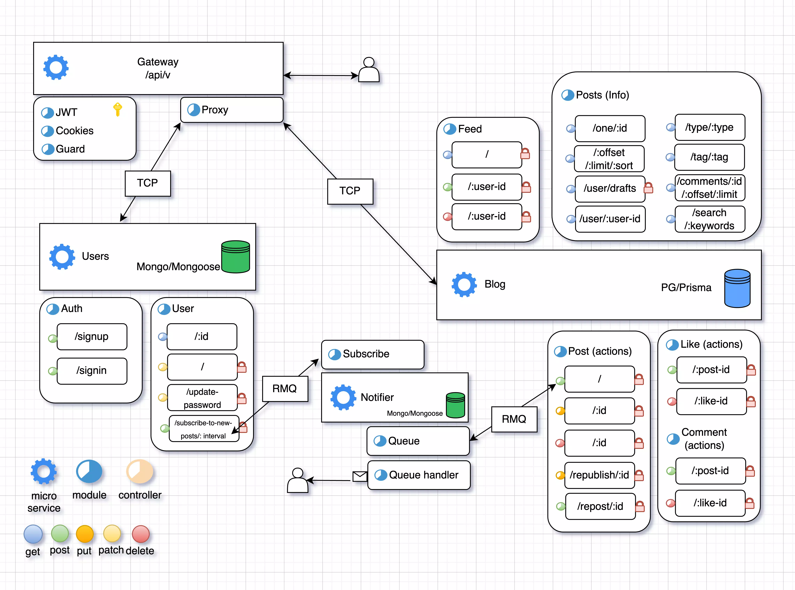

# Nest microservices blog app
Users can post to blog, subscribe to other user's posts, be notified about new posts, etc.

### Stack
Nx, Nest/Express, Postgres/Prisma, Mongo/Mongoose, RabbitMQ, Docker

# Running instance (swagger)

https://sbbsworks.online:46433/docs

fake-smtp, emails received from the queue

https://sbbsworks.online:46380/

&nbsp;
&nbsp;

&nbsp;
&nbsp;

# Install:

### cd project

### sh pdockerenv.sh

### pnpm install

&nbsp;
&nbsp;
&nbsp;
&nbsp;

# Run dev:

### pnpm nx run-many --target=serve --all --maxParallel=10

### open:

swagger api docs

http://localhost:46000/docs

fake-smtp

http://localhost:8080/

&nbsp;
&nbsp;
&nbsp;
&nbsp;

# Run prod:

### pnpm nx run-many --target=build --prod --all

###  sh prod.sh

### open:

swagger api docs

http://localhost:46400/docs

fake-smtp

http://localhost:8080/
